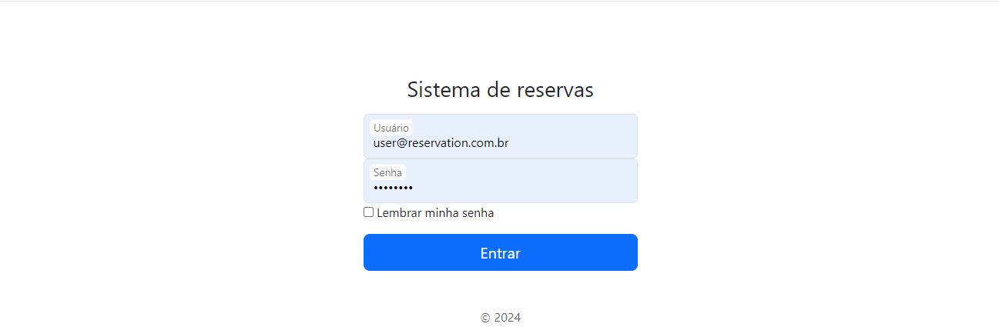
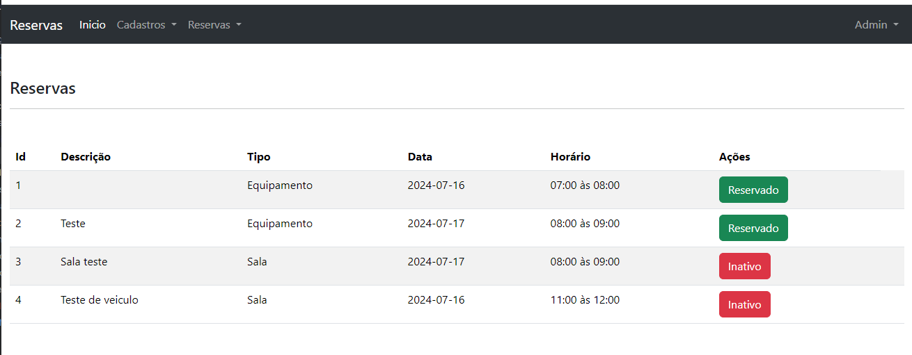

<h1 style="text-align: center">Sistema de reservas 1.0</h1>

---
### Recursos

---

- Cadastro de usuários
  - [X] Equipamentos 
  - [X] Salas 
  - [X] Usuários 
  - [X] Veículos


- Reservas
  - [X] Salas
  - [X] Equipamentos
  - [X] Veículos

---


### Requisitos

---

- PHP 8.3
- Composer
- SQLite
- Docker para ambiente de desenvolvimento

---

### Instalação

---

Entendendo que foi instalado o php e o composer no seu ambiente de produção.

--- 

Acesse a raiz do projeto e rode o comando abaixo para instalar as dependências do projeto:

```bash
  composer install
````

---
Configuração basica do nginx:

```text
server {
    listen 80;
    index index.php;
    error_log /var/log/nginx/error.log;
    access_log /var/log/nginx/access.log;
    error_page 404 /index.php;
    root /var/www/public;

    location / {
        try_files $uri $uri/ /index.php?$query_string;
        gzip_static on;
    }

    location ~ \.php$ {
        try_files $uri =404;
        fastcgi_pass php-fpm:9000;
        fastcgi_index index.php;
        include fastcgi_params;
        fastcgi_param SCRIPT_FILENAME $document_root$fastcgi_script_name;
        fastcgi_param PATH_INFO $fastcgi_path_info;
    }
}

```
---

Após realizar a instalação acesse a pagina https://localhost

Caso você tenha configurado o nginx com algum host acesse a url com o nome do teu host ou IP.

Devera ser viusalizado a páginade login do sistema:



---

### Ambiente de testes com docker

Iniciar o projeto e buildar os containers:

```bash
  docker compose up -d --build
```

Acessar o container nginx:

```bash
  docker exec -it nginx bash
```

Acessar o container php:

```bash
  docker exec -it php-fpm bash
```

Em sistemas Windows o comando bash pode não funcionar, desta forma altere para sh:
```bash
  #Exemplo
  docker exec -it nginx sh
```

---

Após rodar os containers será possível acessar através da URL localhost na porta 80:


---

Após fazer login será direcionado para pagina home do projeto:



---


### Para obter a versão 2.0 ou solicitar algum serviço:

<p style="text-align: center">Acesse a pagina https://wbsartori.com.br</p>
